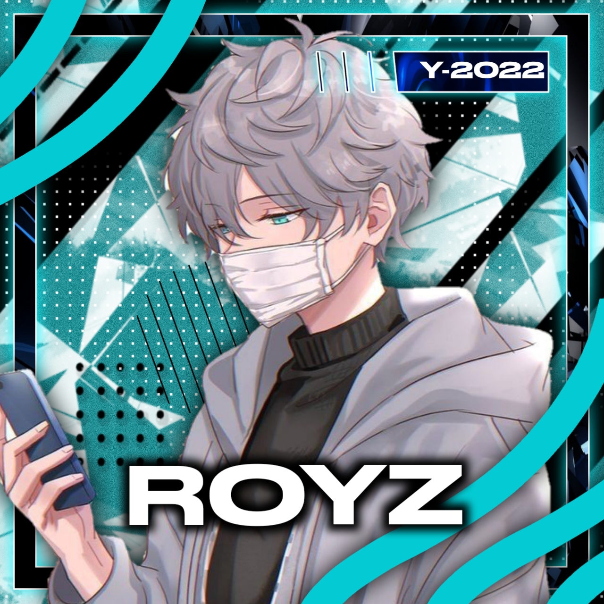

<h3 align="center">💝Royz_v2💝</h3>

## [](https://git.io/typing-svg)

<div align="center">
  
  <p align="center">
<a href="#"></a>
</p>
  <p align="center">
<a href="https://github.com/RoyZ14246"></a>
</p>
</div>
<p align="center">
Project created by <a href="https://github.com/RoyZ14246">RoyZ14246</a> to make it public
    <br>
       | © |
        Reserved |
    <br> 
</p>


get extra feturs use maalutty v3😍⏬

[](https://github.com/RoyZ14246/MAALUTTY_V3)
  </div>
    

## Setup
<div align="center">

  ### Simple Method
 
[](https://replit.com/@Husniser/MAALUTTY-QR)
  

[](https://heroku.com/deploy?template=https://github.com/RoyZ14246/Royz_v2) 
 
### The Hard Method
```js
GET QR
$ apt install git
$ apt install nodejs --fix-missing
$ git clone https://github.com/RoyZ14246/Royz_v2
$ cd Royz_v2
$ npm install @adiwajshing/baileys
$ npm install chalk
$ node maalutty.js
```
      
```js
SETUP
$ git clone https://github.com/RoyZ14246/Royz_v2
$ cd Royz_v2
$ npm i
$ node maalutty.js
```

----

  <p align="center">
  <a href="httsp://github.com/RoyZ14246/Royz_v2">
    
<a href="https://github.com/farhan-dqz/followers">

<p align="center">
<a href="https://github.com/RoyZ14246/followers"
</a>
<a href="https://github.com/RoyZ14246/Royz_v2/stargazers/"></a>
<a href="https://github.com/RoyZ14246/Royz_v2/network/members"></a>
</p>

## 📢 Guide
Click WA logo to Join Support Group 👇
##Not allowed bots on this group 🔰
    <br>
<br>
  [](https://chat.whatsapp.com/FO3JyZPm1ma3vHyEQjaToY)
  <div align="center">


Click WA logo to Join public bot Group👇
##Bots allowed grops 🔰
    <br>
<br>
  [](https://chat.whatsapp.com/BUt420LTGKBHNHALHKV9jJ)
  <div align="center">

  </div>

### youtube👇

[](https://youtube.com/channel/UCllom1TvXieyxcGaanSpMvA)


### contact on instagram👇

[](https://www.instagram.com/_husni_ser_/)

### ❤️ Royz_v2 💙 website⤵️

[](https://Royz_v2nijinhusni.blogspot.com)


### ⚠️ Warning! 
```
Due to Userbot; Your WhatsApp account may be banned.
This is an open source project, you are responsible for everything you do. 
Absolutely, Asena executives do not accept responsibility.
By establishing the Asena, you are deemed to have accepted these responsibilities.
```

## Developer
  <div align="center">
    


 [RoyZ14246](https://github.com/RoyZ14246)
Developer, Base, Bug Fixes, Modules| Re-Developer, Bug Fixes, Modules, Commits |  Modifiying  as   public | Bug Fixes, Modules 
  </div>
    


## License
This project is protected by `GNU General Public Licence v3.0` license.

### Disclaimer
`WhatsApp` name, its variations and the logo are registered trademarks of Facebook. We have nothing to do with the registered trademark
